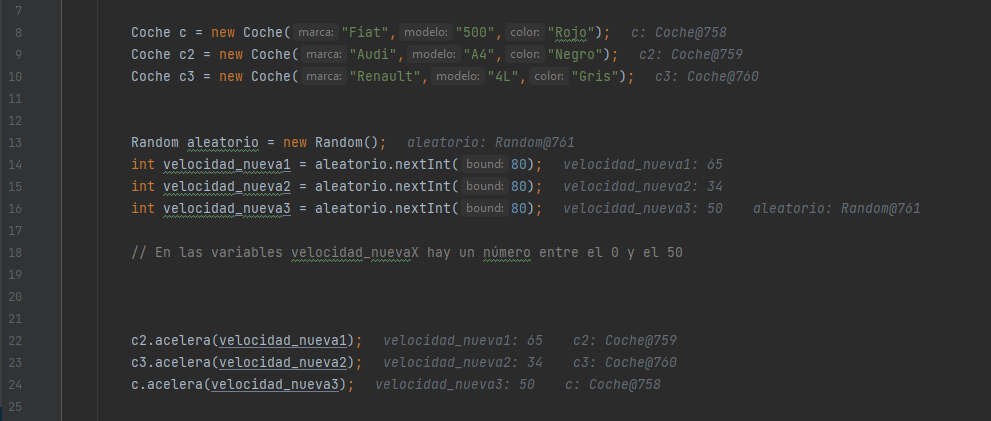
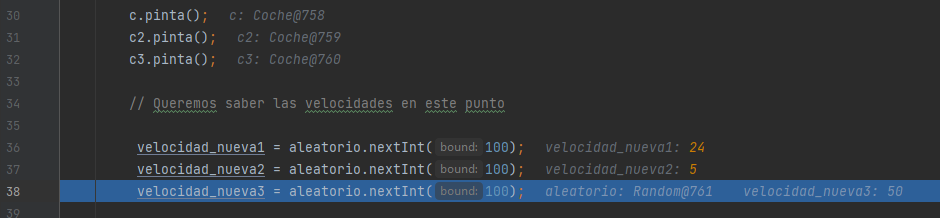

# Ejercicio 2.
Saber obtindre les dades d'un codi java mitjançant eina de depuració de codi.

Enunciat:

Donat el codi a JAVA de la classe cotxe que compta amb els mètodes:

• constructor on se li estableix la marca, model, color i la velocitat inicial del qual és 0.

• getters i setters de cada paràmetre.

• Mètode accelera (int vel) que incrementa la velocitat del cotxe en “vel” Km/h.

• Mètode frena(int vel) que decrementa la velocitat del cotxe en “vel” Km/h.

• para() que posa la velocitat a 0.

• pinta() que pinta el cotxe més a prop o més lluny segons la velocitat que tinga en aqueix moment.

A més , la classe Principal té el mètode:

    pubic static void main(String [] args)
    
    → punt d'inici del programa
    
### 0. Importar el projecte en INTELLIJ.

> Seleccionamos "Setup..." en la advertencia de que no se encuentra SDK y seleccionamos la primera opción.

### 1. Explicad QUÈ FA EL MÈTODE MAIN.

> El método main es el método en donde se desarrolla todo el programa con todas las funciones y métodos creadas con anterioridad, y las llama para que haga todo el código que se encuentra dentro de cada una.

### 2. Posad un punt de ruptura (breakpoint) en la línia 27 del mètode main de la classe Principal i esbrineu els valors de les variables velocitat_nueva1, velocitat_nueva2 i velocitat_nueva3. Esbrineu també quines dades tenen en els seus paràmetres els cotxes amb variables c,c2 i c3.

> 

### 3. Posad un punt de ruptura (breakpoint) en la línia 46 del mètode main de la classe Principal i esbrineu els valors de les variables velocitat_nueva1, velocitat_nueva2 i velocitat_nueva3. Esbrineu també quines dades tenen en els seus paràmetres els cotxes amb variables c,c2 i c3.

> 
> 